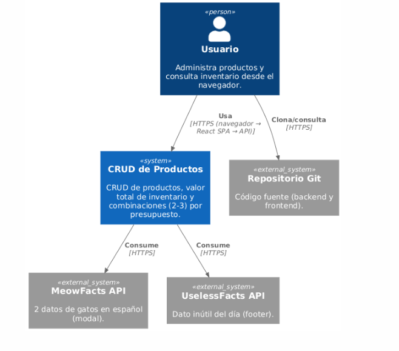
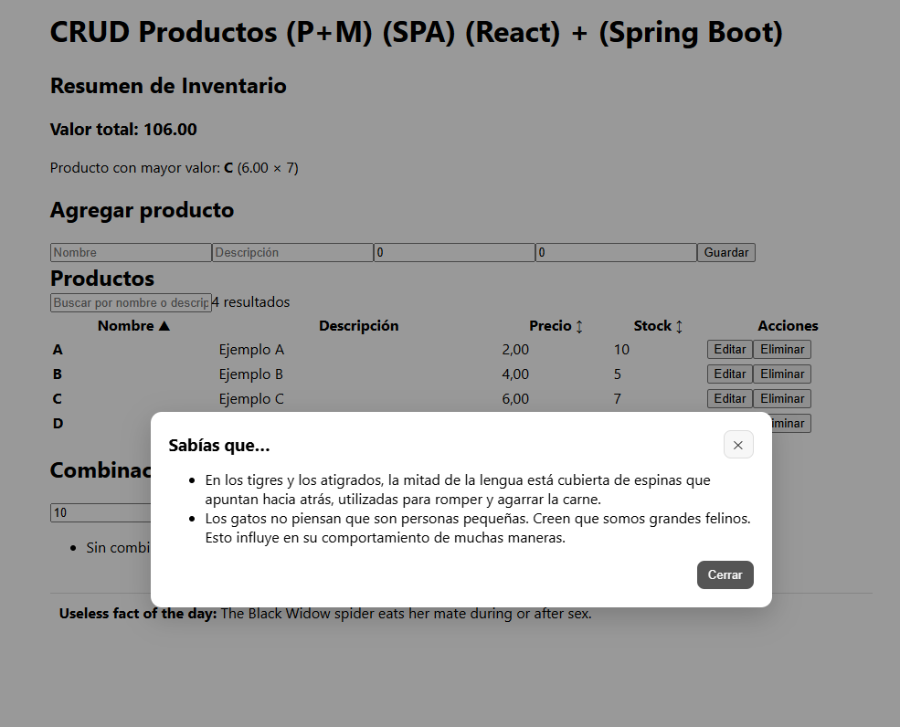
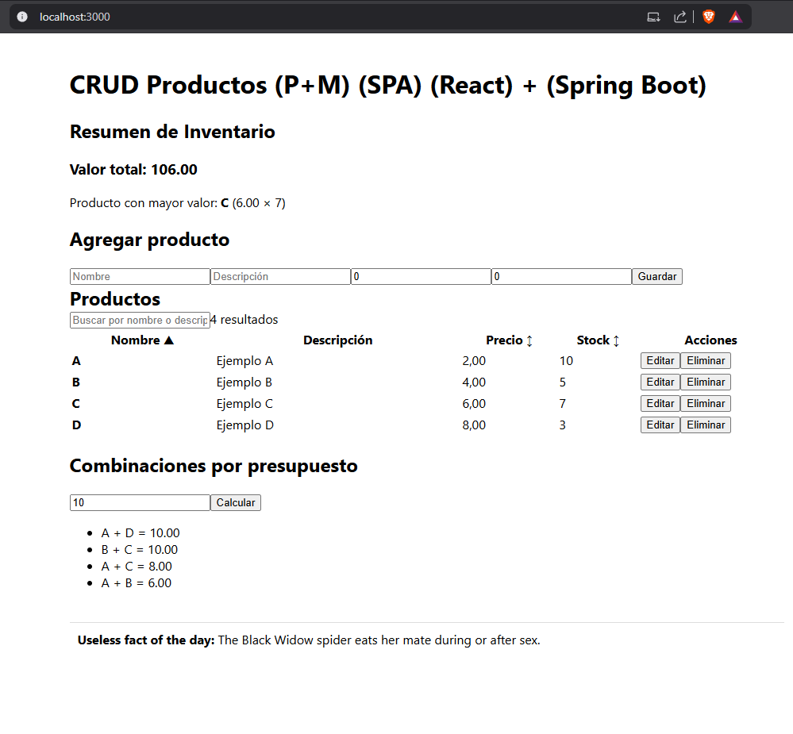
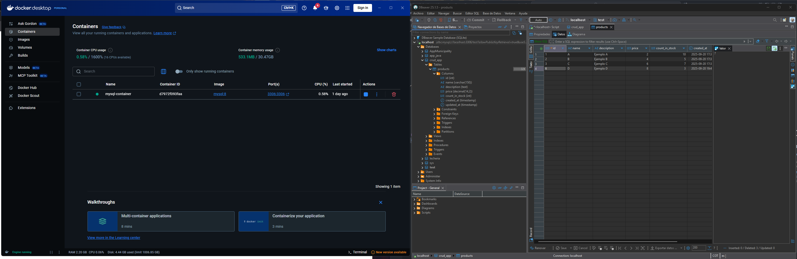
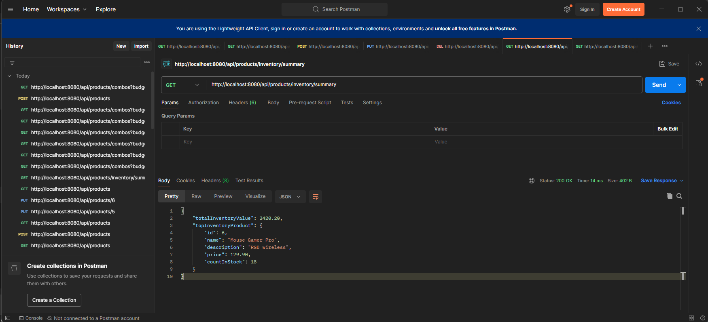

# CRUD Productos — Guía de Arranque (Backend + Frontend)

Este documento explica **con qué se creó cada parte** del proyecto y **cómo ejecutarlo** en local.

---

## Prerrequisitos

- **Java 21+** y **Maven**
- **Node.js 21+** y **npm**
- **MySQL 8+**

---

## Creación del Proyecto

- **Backend**: Creado con [Spring Initializr](https://start.spring.io/)
- **Frontend**: Creado con `npx create-react-app app_frontend`


### Comandos iniciales

```bash
# Ejecutar frontend
cd crud_app_p-m/app/app_frontend
npm i
npm start

# Ejecutar backend
cd crud_app_p-m/app/app_backend/app_backend
mvn spring-boot:run
```

C4 System Context (nivel 1)


Demo App



Efectos practicos se uso docker sin embargo puede usarse cualquiera ( modificar el application properties )



Ejemplo de consumo en postman



## Endpoints clave

### Obtener todos los productos
**GET** `/api/products`

---

### Obtener un producto por ID
**GET** `/api/products/{id}`

---

### Crear un producto
**POST** `/api/products`

**Body (JSON):**
```json
{
  "name": "Mouse Gamer Pro",
  "description": "RGB wireless",
  "price": 4.90,
  "countInStock": 18
}
```

---

### Actualizar un producto
**PUT** `/api/products/{id}`

**Body (JSON):**
```json
{
  "name": "Mouse Gamer Pro",
  "description": "RGB wireless",
  "price": 4.90,
  "countInStock": 18
}
```

---

### Eliminar un producto
**DELETE** `/api/products/{id}`

---

### Resumen de inventario
**GET** `/api/products/inventory/summary`

---

### Obtener combos por presupuesto
**GET** `/api/products/combos?budget=10`

Backup de la base de datos se encuentra en el proyecto en `backup.sql`


`Por efectos practicos de laboratorio no se tuvieron en cuenta (seguridad en las apis, sin embargo soy consiente de que se debe aplicar)`